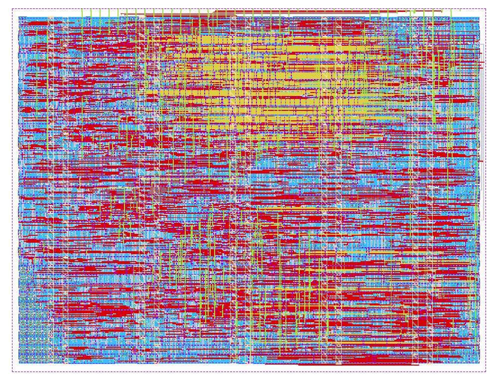

  

# Acoustic drone detector — TinyTapeout IHP 1×1

A self-contained acoustic drone detector for one TinyTapeout IHP sg13g2 tile.
A PDM microphone bitstream goes in and a detection signal comes out. The
integer signal-processing pipeline and ternary neural-network weights are
hard-wired, so the chip needs no host, memory, firmware, or model upload.

```text
 PDM data ──ui[0]──► octave filterbank ─► log levels ─► drone_4 NN ─► uo[3:1]
 mic clock ◄─uo[0]──       5 bands          16 frames
 trim ───ui[7:1]──────────────────────────► threshold
```

## Drone_4 result

The checked-in RTL and weights are the `drone_4` build: the same trained model
as `drone_2` -- bit-exact test AUC **98.92%** on Drone Audio Detection Samples
(DADS) -- with a re-tuned clock tree and a shorter output hold. The weights are
untouched, so the accuracy figure carries over rather than being re-measured.
The reference IHP sg13g2 hardening completed in a 1×1 tile with:

- 94.21% final core utilization and 2,122 instances;
- **zero max-fanout violations** (14 in `drone_2`);
- zero routing, Magic DRC and KLayout DRC errors;
- zero LVS, antenna, setup, and hold violations;
- +5.62 ns worst setup slack and +0.141 ns worst hold slack.

Two changes got there:

- `CTS_SINK_BUFFER_MAX_CAP_DERATE_PCT: 50` clears every max-fanout violation
  for +98 µm². The violations were against the liberty's `default_max_fanout`,
  which an SDC constraint cannot lift, and they were all CTS clock-leaf
  buffers, which `repair_design` will not touch -- so CTS was the only lever.
- The LED hold drops from 629 ms to **41.9 ms**. A drone is a steady source
  that is still there on the next window, so the output should track it rather
  than latch; at 629 ms the LED lagged the aircraft and ran two passes together
  into one. Narrowing the hold counter to match also returned three flip-flops
  and 209 µm². See [docs/hold_width.md](docs/hold_width.md).



The dataset result is not a field false-alarm guarantee. Detection distance was
not measured, and lawnmowers, motorcycles, helicopters, and unfamiliar ambient
sound may confuse an acoustic detector.

## Interface

- `ui[0]`: PDM microphone data.
- `ui[7:1]`: seven-bit threshold trim centered at 64.
- `uo[0]`: 1.5625 MHz PDM microphone clock from the 50 MHz system clock.
- `uo[3:1]`: mirrored active-high detection output.
- `uo[7:4]`: live four-bit band-level debug value.
- `uio[7:0]`: output-only frame, detection, FSM, and microphone-tick debug.

The learned threshold is 14 at trim 64. Each trim step changes it by four:
trim 63 gives threshold 10, while trim 62 gives threshold 6. On the held-out
dataset, threshold 10 gave 65.8% recall at 0.7% negative clips firing;
threshold 6 gave 95.2% recall at 4.1% negative clips firing.

## Verification

The cocotb tests compare RTL against a local bit-exact Python model:

```bash
python -m pip install -r test/requirements.txt
cd test
make                         # shortened frames, suitable for quick checks
FRAME_LOG2=16 make           # exact tape-out frame length
```

Fourteen tests check reset and clock behaviour,
every filterbank frame against the model, the detector output trace, the exact
mic-clock divider, the LED hold length in frames, reset of a lit LED, a mic
stuck at either rail, trim monotonicity and the threshold arithmetic across the
trim range, recovery from a mid-frame reset, bit-exactness on a quiet-to-loud
ramp, and that `uio_in` and `ena` change nothing -- the same stimulus with those
pins parked and with them moving must give identical outputs, clock for clock.
They also check every debug/output pin against a non-zero internal snapshot and
drive a guaranteed real classifier fire through all four detection outputs.
The full-length RTL pass omits six behavioural checks already covered by the
fast parameter-equivalent RTL build. The gate-level pass runs all fourteen:
tests that inspect or deposit RTL registers have public-pin gate variants, and
classifier tests run far enough to close a real staggered window. This makes
the gate job several hours long, but prevents a green netlist run whose
detection output never asserted. The unused-pins check remains shortened to a
sixteenth of a frame because its clock-for-clock comparison needs no frame
boundary. Here "complete gate-level suite" means all named public-interface
behaviours execute on the netlist; the separate 100% waived coverage figure is
an RTL logic-coverage measurement, not a standard-cell-netlist toggle claim.

Every RTL build also compiles the `WW_ASSERT` block at the bottom of the RTL:
six elaboration-time parameter checks and eight per-cycle invariants on the
hold counter, the requantise sign, the FSM and the outputs, for ~0.5 s. Because
they hold under every stimulus, all fourteen tests are scenarios for them.
`src/config.json` never defines `WW_ASSERT`, and that the block does not reach
synthesis is verified rather than argued -- re-running the flow with it present
produced a byte-identical netlist.

```bash
./scripts/assert_mutations.sh   # reintroduce 12 real bugs; each must be caught
./scripts/coverage.sh           # verilator line/branch/expr/toggle coverage, raw and waived
```

The mutation test is what makes those assertions evidence rather than
decoration -- an assertion that has never failed may be a tautology, and it has
already caught one of mine that permitted a permanently lit LED. Two mutations
make the design read `uio_in` and gate on `ena`; three more disable the real fire
path, break a detection mirror, and make the threshold comparison inclusive.
The named tests must fail.

Coverage prints two figures. Raw, the RTL sits at 85.7% line, 88.2% branch,
85.5% expression and 92.4% toggle. After `test/coverage_waivers.txt` -- one
line per point that cannot be reached at the shipped parameters and weights,
each with its proof, and the script fails if a proof goes stale -- it is 100%
on all four. Three of the fourteen tests exist because that measurement found a
gap. See [docs/coverage.md](docs/coverage.md).

GitHub Actions also runs TinyTapeout precheck, GDS generation, and gate-level
simulation.

See [the generated datasheet](docs/info.md) for connection and usage details.

## License

Apache-2.0. See [LICENSE](LICENSE).
