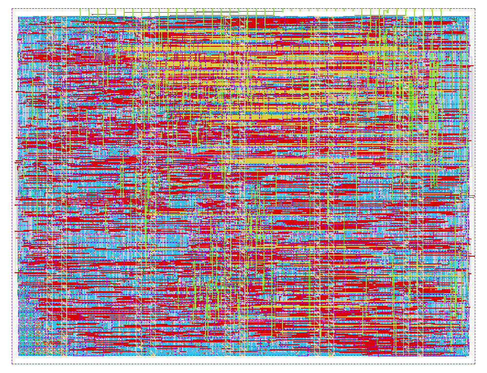

  

# Acoustic drone detector — TinyTapeout IHP 1×1

A self-contained acoustic drone detector for one TinyTapeout IHP sg13g2 tile.
A PDM microphone bitstream goes in and a detection signal comes out. The
integer signal-processing pipeline and ternary neural-network weights are
hard-wired, so the chip needs no host, memory, firmware, or model upload.

```text
 PDM data ──ui[0]──► octave filterbank ─► log levels ─► drone_2 NN ─► uo[3:1]
 mic clock ◄─uo[0]──       5 bands          16 frames
 trim ───ui[7:1]──────────────────────────► threshold
```

## Drone_2 result

The checked-in RTL and weights are the `drone_2` model trained on Drone Audio
Detection Samples (DADS). Its bit-exact test AUC is **98.92%**. The reference
IHP sg13g2 hardening of the same logic completed in a 1×1 tile with:

- 94.60% final core utilization and 1,675 standard cells;
- zero routing and Magic DRC errors;
- zero LVS, antenna, setup, and hold violations;
- +6.40 ns worst setup slack and +0.135 ns worst hold slack;
- 4.76 mW estimated total power at the typical corner.



The dataset result is not a field false-alarm guarantee. Detection distance was
not measured, and lawnmowers, motorcycles, helicopters, and unfamiliar ambient
sound may confuse an acoustic detector.

## Interface

- `ui[0]`: PDM microphone data.
- `ui[7:1]`: seven-bit threshold trim centered at 64.
- `uo[0]`: 1.5625 MHz PDM microphone clock from the 50 MHz system clock.
- `uo[3:1]`: mirrored active-high detection output.
- `uo[7:4]`: live four-bit band-level debug value.
- `uio[7:0]`: output-only frame, detection, FSM, and microphone-tick debug.

The learned threshold is 14 at trim 64. Each trim step changes it by four:
trim 63 gives threshold 10, while trim 62 gives threshold 6. On the held-out
dataset, threshold 10 gave 65.8% recall at 0.7% negative clips firing;
threshold 6 gave 95.2% recall at 4.1% negative clips firing.

## Verification

The cocotb tests compare RTL against a local bit-exact Python model:

```bash
python -m pip install -r test/requirements.txt
cd test
make                         # shortened frames, suitable for quick checks
FRAME_LOG2=16 make           # exact tape-out frame length
```

The tests check reset/clock behavior, every filterbank frame, and the detector
output trace. GitHub Actions also runs TinyTapeout precheck, GDS generation,
and gate-level simulation.

See [the generated datasheet](docs/info.md) for connection and usage details.

## License

Apache-2.0. See [LICENSE](LICENSE).
